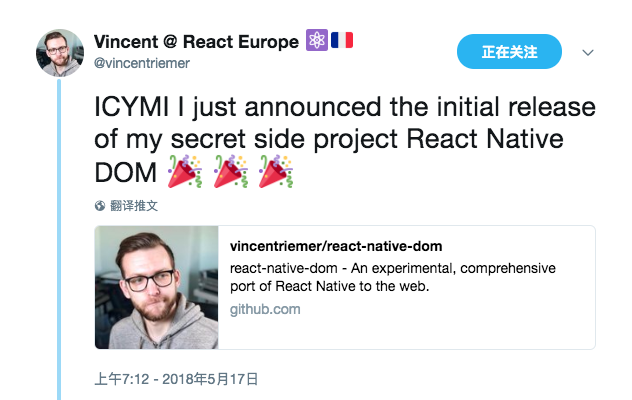

心血来潮刷了下 Twitter，看到 Vjeux 大神转发了一条动态：



说是一位名叫 Vincent 的同学发布了一个秘密业余项目 react-native-dom，github 的 readme 上介绍这是 React Native 在 web 上的一个完备的试验性移植。当时想的是已经有了一个项目 react-native-web，这是重复造轮子吗？但是随着了解的深入，发现他们之间的实现思路和完备性都是不一样的。

先说说 react-native-web，第一次接触这个库是公司的 RN 组件库文档需要一个能在浏览器预览组件运行效果的功能，但是恰好刚刚了解了这个库，于是就上手把玩了一下，效果挺好的，但是只有一些简单的展示型组件和在手机中的效果是接近的，一些特性比如 tintColor 和动画支持得不是太好。当时使用的版本是低于 0.1.0 的，现在看已经到 0.7.1 了，有可能已经支持得很好了，后面因为不能预览所有组件的效果，宁为“瓦全”，不为“玉碎”，所以这个功能没多久就撤掉了。这个库在当时乃至现在看来都是非常牛的，让我们看到了 RN 更多的可能性。

## 后起之秀

react-native-dom 第一个吸引我的地方是：如果你有一个 RN 的项目，只需要三个命令就可以让 RN 程序跑在浏览器里。

``` bash
npm install --save-dev rnpm-plugin-dom
react-native dom
react-native run-dom
```

首先 react-native-cli 开放出这种接口说明了 RN 扩张的野心，然后 react-native-dom 使用了这个接口说明了它和 react-native-web 不同的实现思路。

运行了 `react-native dom` 命令之后