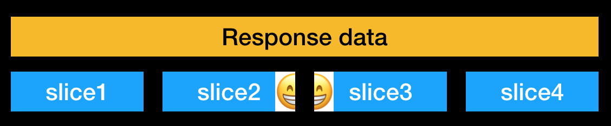

一天，业务开发同学反馈了一个 RN 的问题，RN 项目在 Android APP 中启动后报如下错误导致崩溃：

```
E/unknown:React: Exception in native call
    java.lang.RuntimeException: Error calling RCTDeviceEventEmitter.emit
        at com.facebook.react.bridge.queue.NativeRunnable.run(Native Method)
        at android.os.Handler.handleCallback(Handler.java:754)
        at android.os.Handler.dispatchMessage(Handler.java:95)
        at com.facebook.react.bridge.queue.MessageQueueThreadHandler.dispatchMessage(MessageQueueThreadHandler.java:31)
        at android.os.Looper.loop(Looper.java:163)
        at com.facebook.react.bridge.queue.MessageQueueThreadImpl$3.run(MessageQueueThreadImpl.java:204)
        at java.lang.Thread.run(Thread.java:760)
     Caused by: com.facebook.jni.CppException: Failed to create String from JSON: 
        at com.facebook.react.bridge.queue.NativeRunnable.run(Native Method) 
        at android.os.Handler.handleCallback(Handler.java:754) 
        at android.os.Handler.dispatchMessage(Handler.java:95) 
        at com.facebook.react.bridge.queue.MessageQueueThreadHandler.dispatchMessage(MessageQueueThreadHandler.java:31) 
        at android.os.Looper.loop(Looper.java:163) 
        at com.facebook.react.bridge.queue.MessageQueueThreadImpl$3.run(MessageQueueThreadImpl.java:204) 
        at java.lang.Thread.run(Thread.java:760)
```

我们立刻开始根据报错信息展开分析，这是在执行 `RCTDeviceEventEmitter.emit` 方法的时候报出来的错，原因是 C++ 抛出的一个错误 `Failed to create String from JSON:`。根据业务同学提供的重现步骤和一些信息重现了问题，初步梳理出如下线索：

1. 只有 Android 平台存在这个问题
2. 只有线上环境会有这个问题，预发环境没问题
3. 目前只发现一位用户会触发这个问题，这位用户的页面中的网络请求结果中包含 emoji 字符

开始怀疑 RN 解析 emoji 字符有问题，但是很快被上述第二条线索否定了，因为预发环境的请求结果与线上一致，也包含 emoji（并且抓包对比两个环境的返回结果确认完全一样）。

就在一筹莫展的时候，泽义同学提到网络请求返回结果是原生通过 DeviceEventEmitter 传给 JS 的，可以尝试在 JS 端接受到事件的时候打印日志对比一下线上环境和预发环境的区别。

这里要向读者提一句，我们的 RN 项目在线上环境为了防止打印多余日志，重写了 `window.console` 对象，并且顺带初始化了 RN 的 sentry sdk：

``` js
import Console from 'custom-sentry-sdk';
window.console = new Console({ dsn, options });
```

因此如果我想使用 `console.log` 打印日志，需要注释掉上面的代码。然而就在注释后重新运行项目时，发现没有报错了！没有报错了！！

于是我们放下对比日志的工作，开始对 sentry sdk 源码进行拷问，使用“删除代码定位法”辅以二分法，最终找到了问题所在，拎出来示众：

``` js
// raven-js/src/raven.js

// if onreadystatechange wasn't actually set by the page on this xhr, we
// are free to set our own and capture the breadcrumb
xhr.onreadystatechange = onreadystatechangeHandler;
```

sentry sdk 代理了 XMLHttpRequest 的 `onreadystatechange` 事件，用于收集错误日志产生前所发生的网络请求，而我们平常用 fetch 方法不会监听这个事件，就是这个操作导致的最终结果不一样，至于为什么，这里留下一个疑团，我们继续对比日志。

重写 `window.console` 的代码是不能注释掉了，我们想办法获取到了原始的 console 对象，这样我们来打印出一个请求过程中 JS 接收到的原生事件以及参数：

1. 预发环境（正常）的日志：

    ```
    didReceiveNetworkResponse   [1, 200, '<Response Header>']
    didReceiveNetworkData       [1, '<Response Body>']
    didCompleteNetworkResponse  [1, null]
    ```

2. 线上环境其他用户的请求（正常）的日志：

    ```
    didReceiveNetworkResponse         [1, 200, '<Response Header>']
    didReceiveNetworkIncrementalData  [1, '<Response Body0>']
    didReceiveNetworkIncrementalData  [1, '<Response Body1>']
    didReceiveNetworkIncrementalData  [1, '<Response Body2>']
    didReceiveNetworkIncrementalData  [1, '<Response Body3>']
    didReceiveNetworkIncrementalData  [1, '<Response Body4>']
    didReceiveNetworkIncrementalData  [1, '<Response Body5>']
    didCompleteNetworkResponse        [1, null]
    ```

3. 线上环境有问题用户的请求（报错）的日志：

    ```
    didReceiveNetworkResponse         [1, 200, '<Response Header>']
    didReceiveNetworkIncrementalData  [1, '<Response Body1>']（一部分数据）
    didCompleteNetworkResponse        [1, null]
    （报错）
    ```

对比了下上面三组日志，总结几个现象：

1. 预发环境的正常情况 response body 数据一次性由原生传给 JS
2. 线上环境的正常情况 response body 数据分多片由原生传给 JS
3. 线上环境的报错情况 response body 数据传完了第一片之后就报错了

得出的结论是监听 onreadystatechange 事件会导致原生响应请求数据时分片，而分片又出于某种原因导致 C++ 解析字符串报错。基于这个结论我们产生了一个想法，一个 emoji 是多个字节组成的，如果分片切割的时候恰好从 emoji 中间切开，emoji 的前半部分被分在了前一个分片，后半部分被分在了后一个分片中，如图所示：



为了证实这个猜想，我们不得不踏上前往原生世界的“冒险”。JS 如果希望发起一个网络请求，需要向原生发送请求信息，我们注意到这其中有一个参数 incrementalEvents，认为这个是决定响应数据是否分片的一个参数，上面提到的 sentry sdk 监听 onreadystatechange 事件，会让 incrementalEvents 参数变为 `true`，留下的疑团也解开了：

``` js
// XMLHttpRequest.js
send(data) {
  // ...
  // 如果 onredystatechange 设置了监听函数，则 incrementalEvents 为 true
  const incrementalEvents = this._incrementalEvents ||
      !!this.onreadystatechange ||
      !!this.onprogress;
  // ...
  // 发往原生
  RCTNetworking.sendRequest(
    this._method,
    this._trackingName,
    this._url,
    this._headers,
    data,
    nativeResponseType,
    incrementalEvents,
    this.timeout,
    this.__didCreateRequest.bind(this),
  );
}
```

带着疑惑，我们在 RN 的原生网络模块中发现了一些逻辑证实了上面的想法。Java 在 http 请求收到响应后判断 useIncrementalUpdates 如果为 true，就每次从 response body stream 中读取 16KiB 的数据，读完马上使用事件通知 JS，直到读完为止：

``` java
// com.facebook.react.modules.network.NetworkingModule
Reader reader = responseBody.charStream();
try {
  char[] buffer = new char[8 * 1024];
  int read;
  while ((read = reader.read(buffer)) != -1) {
    ResponseUtil.onIncrementalDataReceived(
      eventEmitter,
      requestId,
      new String(buffer, 0, read),
      totalBytesRead,
      contentLength);
  }
} finally {
  reader.close();
}
```

通过断点调试，断定了就是 emoji 被切到了两片中去，下面是每次循环中的 buffer 内容：

```
[123, 34, ... , 67, 68]         char[8 * 1024]，从 response body stream 中读取 16KiB 数据
[123, 34, ... , 23458, 55356]   char[8 * 1024]，从 response body stream 中读取 16KiB 数据
[56728, 34, ... , 42, 89]       char[8 * 1024]，从 response body stream 中读取 16KiB 数据
.
.
.
```

第二片数据的末尾和第三片的开头正好能组成一个 emoji 字符，`String.fromCharCode(55356, 56728) // 🆘 `  ，而 JSC 的 `JSValueMakeFromJSONString` 方法认为 `55356` 是一个非法的 UTF-8 字符，从而导致最开始提到的报错。

至于解决方案，开始在网上搜了一下没找到有用的信息，在搞清楚问题的原因后，马上就发现新版 RN 已经有人提 PR 解决了这个问题，方法是对当前分片的字节数据进行 UTF-8（默认）解码，如果有无法解码的字节数据，就把无法解码的部分加到下一个分片的开头。只要给我们的 RN 版本打上这个补丁就 OK 了。

## 后记

这过程中曾经偶然尝试了其它 APP 上跑同样的代码，却不会出现上述问题，经过一番断点调试，发现区别在于，这些 APP 的分片长度不一样，并且一个 emoji 不会被分到两片上去：

```
[123, 34, ... , 40, 42, 0, 0, 0, 0, ...]         char[8 * 1024]，从 response body stream 中读取 1KiB 数据
[123, 34, ... , 55356, 56728, 0, 0, 0, 0, ...]   char[8 * 1024]，从 response body stream 中读取 5KiB 数据
[67, 34, ... , 42, 89, 0, 0, 0, 0, ...]          char[8 * 1024]，从 response body stream 中读取 3KiB 数据
.
.
.
```

调试发现，上面有问题的 APP 上，有另外一个 sdk 需要收集 RN 的网络请求数据，通过拦截器把 response body stream 读了一遍，当 RN 本身流程去读的时候，所有返回数据都缓冲好了，因此每次都能读出 16KiB 的数据；没有问题的 APP 上则是缓冲一部分读一部分，令人惊讶的是使用模拟数据测试了很多次，它都能刚好避免把一个 emoji 分到两个个分片中导致非法 UTF-8 字符的出现。由于知识有限，这里最终没能搞清楚。
